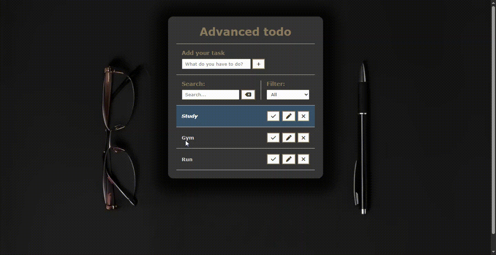

# Advanced ToDo

This is an advanced *ToDo* list app built entirely with plain JavaScript, designed for learning and practice purposes. It allows users to add tasks, mark them as completed, delete them, and search through the list. Tasks are saved using `localStorage`, so your data stays even after closing the file.

---

## Features

- ✅ Add new tasks
- 🕹️ Mark/unmark tasks as done
- 🗑️ Delete tasks
- 🔎 Search tasks by text
- 💾 Auto-save with *localStorage*
- 📱 Simple and beauty interface

---

## Technologies Used

- HTML5  
- CSS3  
- JavaScript (Vanilla)

---

## Demo

